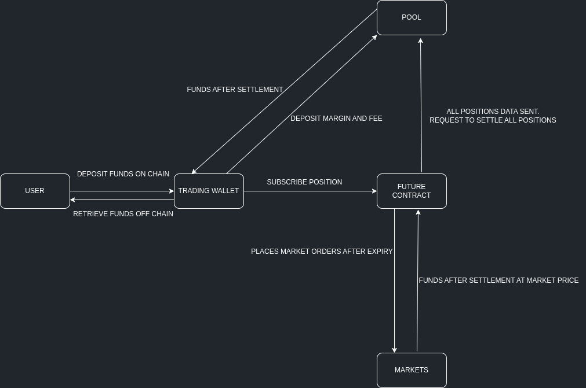

# Zero Day Futures Contracts Trading Platform

Z-DayFutures is a first-of-its-kind Zero Day Futures Contract trading platform on Aptos blockchain, allowing users to buy or sell positions on a zero-day Futures Contract.

## Table of Contents
- [Context](#context)
- [Features](#features)
- [Technical Specifications](#techspecs)
- [Architecture](#architecture)
- [Security](#security)
- [API Docs](#apidocs)
- [Tech Stack](#techstack)
- [Whitepaper](#whitepaper)
- [Future Scope](#futurescope)

---

## Context

### What are futures?
Futures are financial contracts where parties agree to buy or sell an asset (like commodities, currencies, stocks, or indices) at a predetermined price on a specified future date. These contracts enable investors to speculate on the future price of the underlying asset.

Futures markets play a crucial role in the global economy, providing risk mitigation opportunities for investors and businesses.

### What are zero day futures?
Zero-day futures, in contrast, involve speculating on immediate events or information releases occurring on the same date. It's a unique form of futures trading that focuses on immediate impacts rather than longer-term predictions.

---

## Features

- **Block-STM Technology**
  - Z-dayFutures leverages the Block-STM technology to ensure extremely high Transactions per Second (TPS) during peak hours while upholding the reliability and security of assets.

- **Econia's Finance Engine**
  - The platform utilizes Econia's Finance Engine, optimizing order storage efficiency and facilitating low latency order executions with swift settlements.

- **Multi-Platform Availability**
  - Z-dayFutures is accessible through both web and mobile applications (iOS & Android), widening its reach and user accessibility.

- **User-Friendly Interface**
  - The platform offers an intuitive and easy-to-understand design, enhancing user experience and accessibility.

---

## Technical Specifications

### Smart Contracts

- **Wallet Contract**
  - Trader's wallet designed to securely store on-chain assets received from their own wallets and profits accrued.

- **Pool Contract**
  - Manages initial margin collection from traders, handles fee retrieval, and facilitates margin transfer during position changes. Post-zero day, this contract oversees the settlement process.

- **Calc Contract**
  - Performs critical calculations regarding user positions' data on-chain, ensuring accurate and transparent computations.

- **Coins Contract**
  - Generates test tokens to validate and assess the functionality of the market, allowing risk-free experimentation.

---

## Architecture

*ARCHI: The system architecture of Z-dayFutures.*

The architecture diagram demonstrates the system design of Z-dayFutures, depicting the interaction between different components and entities involved in the platform.

---

## Security

- **Resource-Centric Model**
  - The platform follows a resource-centric model, designed to prevent accidental loss of funds and ensure robust security measures.

- **Non-Custodial Asset Handling**
  - Econia pool and Trading Wallet operate as smart contracts with their reserves, facilitating non-custodial asset handling.

- **Low Latency Fund Transfer**
  - Immediate and low latency fund transfers after the 24-hour mark minimizes potential loss due to market fluctuations.

---

## API Docs

*API documentation will be added shortly.*

---

## Tech Stack

  
  
  
  
  

---

## Whitepaper

[ZDayFutures Whitepaper](https://pdfhost.io/v/nMkDjCl5D_whitepaper_1)

---

## Future Scope

- **N-Day Futures**
  - Plans are underway to expand trading options by introducing N-Day Futures contracts with minor adjustments to the smart contract.

- **Enhanced Liquidity Providing Pools**
  - The platform aims to create more complex liquidity pools, offering more lucrative fee incentives for Liquidity providers.

- **Real-Time Oracles Integration**
  - Future plans involve integrating real-time Oracles for price feed, reducing dependency on active market conditions and limit orders for market price determination.

---
